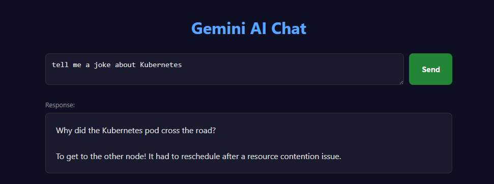

# Gemini AI Chat (Docker + Kubernetes)

A simple web-based chat application powered by Google Gemini, running on Flask and containerized with Docker.

## Prerequisites

- [Docker Desktop](https://www.docker.com/products/docker-desktop/) installed
- A [Gemini API key](https://aistudio.google.com/apikey)

## Getting Started

Build and run locally with Docker:

```bash
docker build -t acrliorsc.azurecr.io/openai-k8s:1.0.0 .
docker run -d -p 5000:5000 -e GEMINI_API_KEY="<your-gemini-api-key>" acrliorsc.azurecr.io/openai-k8s:1.0.0
```

Open **http://localhost:5000** in your browser.

## Example



Push the image to your container registry:

```bash
docker push acrliorsc.azurecr.io/openai-k8s:1.0.0
```

## Use Kubernetes

1. Edit `k8s/secret.yaml` and replace `REPLACE_WITH_YOUR_GEMINI_API_KEY` with your actual Gemini API key.
2. (Optional) Edit `k8s/deployment.yaml` to update the image name if needed.
3. Apply the manifests:

```bash
kubectl apply -f k8s/
```

This creates:
- A `gemini-chat-new` namespace
- A Secret with your `GEMINI_API_KEY`
- A Deployment running the app on port 5000
- A Service exposing the app on port 80

## Use Helm

1. Edit `helm/values.yaml` and set `geminiApiKey` to your actual Gemini API key.
2. Create the namespace and install the chart:

```bash
kubectl create ns gemini-chat-new
helm install gemini-chat . -n gemini-chat-new
```

To uninstall:

```bash
helm delete gemini-chat -n gemini-chat-new
```


